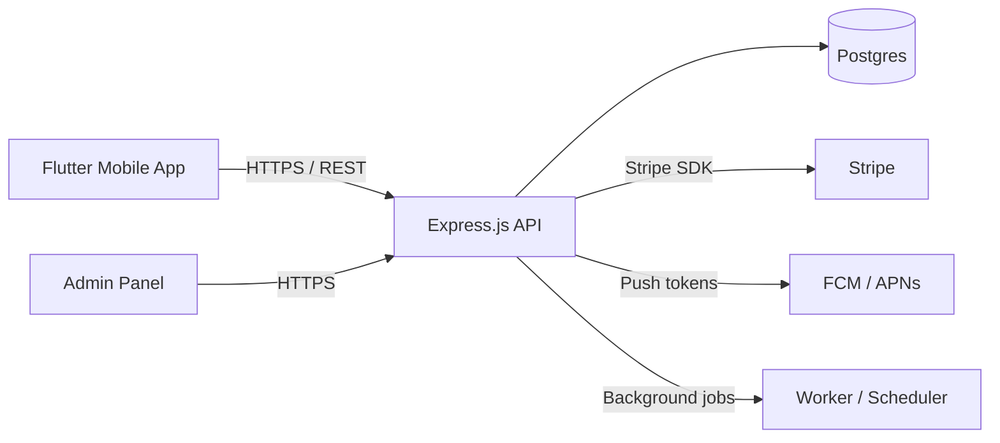

# Attendance Tracker — Parent App

A mobile app (Flutter) that helps parents track their students' attendance, communicate with teachers, and manage subscription payments. The mobile client talks to an Express.js REST API for data, authentication, notifications, and payments.

## Table of Contents
- Overview
- Features
- Screenshots
- System architecture
- Development & Run


## Overview

This project is a parent-facing attendance tracker. It provides:
- Day-by-day attendance calendar with status markers (Present / Absent / Late).
- Detailed history and reports for terms or the academic year.
- In-app messaging to communicate with teachers about absences.
- Subscription management (payments) and plan selection.
- Push notifications and alerts for important updates.

The mobile frontend is built in Flutter. The backend is an Express.js API server that handles authentication, data storage, subscription billing integration (e.g. Stripe), and notification delivery.

## Features

- Attendance calendar with color-coded markers
- Selected-day details and quick actions (report absence, excuse, message teacher)
- Detailed history and aggregated attendance stats (rate, lates, absences)
- Push notifications and alert center
- Parent / Guardian profile and student profile cards
- Subscription management (free / pro / family tiers) using a payment provider
- Teacher communication (in-app messaging or email fallback)
- Export reports (PDF/CSV)

 
## System Architecture

High-level components:

- Mobile Client: Flutter app (iOS / Android) — UI, local caching, push registration
- Backend API: Express.js REST API — authentication, business logic, data access
- Database: PostgreSQL (or Firebase / MongoDB) for persisting users, students, attendance
- Payment Provider: Stripe (or similar) for subscription billing
- Push Service: Firebase Cloud Messaging (FCM) / APNs for push notifications
- Worker / Scheduler: background jobs for sending summaries, generating reports

Mermaid diagram (place in rendered docs where supported):



Notes:
- Secure all API traffic with HTTPS.
- Use JWT or OAuth2 for authentication; store refresh tokens securely.
- Keep sensitive keys (Stripe, DB credentials) in environment variables or a secrets manager.

 
## Development & Run

Mobile (Flutter):

```bash
cd app
flutter pub get
flutter run
```
 
 